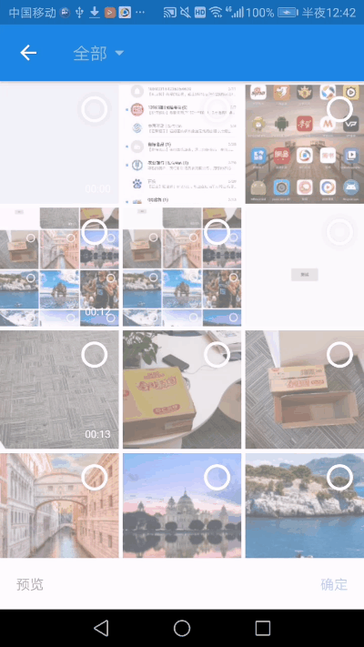

# SmartMediaPicker 多媒体选择器 
[](https://jitpack.io/#BzCoder/SmartMediaPicker)

主要还是站在了巨人的肩膀上，封装了以下两个库，修复[仿微信拍照Android控件](https://github.com/CJT2325/CameraView)中存在的几个BUG。也欢迎在提出更多的使用配置需求。
- [知乎matisse](https://github.com/zhihu/Matisse)
- [仿微信拍照Android控件](https://github.com/CJT2325/CameraView)
## 演示

| 图片选择                  | 仿微信拍照录像                    | 
|:------------------------------:|:---------------------------------:|
| |  |

## 改动
- v1.0.7
   - 添加实用工具类
   - 不再直接依赖Glide
- v1.0.6
   - 修复内存泄漏问题
- v1.0.5
   - 发布
## 使用方法
### gradle添加：
```gradle

	allprojects {
		repositories {
			...
			maven { url 'https://jitpack.io' }
		}
	}


	dependencies {
	        implementation 'com.github.BzCoder:SmartMediaPicker:1.0.7'
	}
```
### 代码添加：
```java
  SmartMediaPicker.builder(getSupportFragmentManager())
                        //最大图片选择数目
                        .withMaxImageSelectable(5)
                        //最大视频选择数目
                        .withMaxVideoSelectable(1)
                        //图片选择器是否显示数字
                        .withCountable(true)
                        //最大视频长度
                        .withMaxVideoLength(15 * 1000)
                        //最大视频文件大小 单位MB
                        .withMaxVideoSize(1)
                        //最大图片高度 默认1920
                        .withMaxHeight(1920)
                        //最大图片宽度 默认1920
                        .withMaxWidth(1920)
                        //最大图片大小 单位MB
                        .withMaxImageSize(5)
			 //设置图片加载引擎
                        .withImageEngine(new Glide4Engine())
                        .build()
                        .show();
```
### ImageEngine
需要自己实现图片加载，图片加载类需要实现ImageEngine接口，当然也可以直接复制一下代码：
```java
/**
 * {@link ImageEngine} implementation using Glide.
 */

public class Glide4Engine implements ImageEngine {

    @Override
    public void loadThumbnail(Context context, int resize, Drawable placeholder, ImageView imageView, Uri uri) {
        Glide.with(context)
                .asBitmap() // some .jpeg files are actually gif
                .load(uri)
                .apply(new RequestOptions()
                        .override(resize, resize)
                        .placeholder(placeholder)
                        .centerCrop())
                .into(imageView);
    }

    @Override
    public void loadGifThumbnail(Context context, int resize, Drawable placeholder, ImageView imageView,
                                 Uri uri) {
        Glide.with(context)
                .asBitmap() // some .jpeg files are actually gif
                .load(uri)
                .apply(new RequestOptions()
                        .override(resize, resize)
                        .placeholder(placeholder)
                        .centerCrop())
                .into(imageView);
    }

    @Override
    public void loadImage(Context context, int resizeX, int resizeY, ImageView imageView, Uri uri) {
        Glide.with(context)
                .load(uri)
                .apply(new RequestOptions()
                        .override(resizeX, resizeY)
                        .priority(Priority.HIGH)
                        .fitCenter())
                .into(imageView);
    }

    @Override
    public void loadGifImage(Context context, int resizeX, int resizeY, ImageView imageView, Uri uri) {
        Glide.with(context)
                .asGif()
                .load(uri)
                .apply(new RequestOptions()
                        .override(resizeX, resizeY)
                        .priority(Priority.HIGH)
                        .fitCenter())
                .into(imageView);
    }

    @Override
    public boolean supportAnimatedGif() {
        return true;
    }

}
```
### 实用工具类：
- SmartMediaPicker.getFileType(String url) ：获取文件类型
- SmartMediaPicker.getVideoDuration(String path)：获取视频时长
- SmartMediaPicker.getVideoPhoto(SString path)：获取视频缩略图

### 获取选择的资源：

```java
    protected void onActivityResult(int requestCode, int resultCode, @Nullable Intent data) {
        List<String> resultData = SmartMediaPicker.getResultData(this, requestCode, resultCode, data);
        if (resultData != null && resultData.size() > 0) {
            tv_path.setText(Arrays.toString(resultData.toArray()));
        } else {
            tv_path.setText("NO DATA");
        }
    }
```
